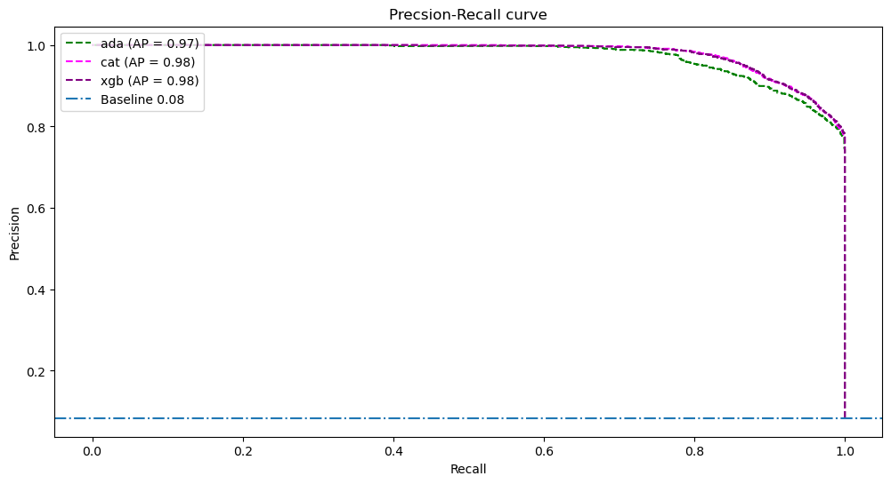
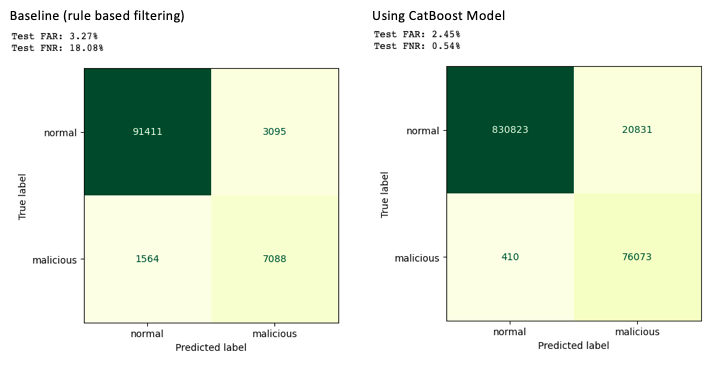

# Network Intrusion Detection - Classification of network traffic

## Background

With increasing cases of cyber attacks, it is important to identity irregular or abnormal network traffic. A network-based intrusion detection system (NIDS) is usually in place after the firewall to analyse inbound and outbound network packets for patterns of malicious behavior.

The NIDS passively collects data and analyse to determine whether the information falls outside normal activity based on a knowledge base. If so, an alert is sent ([source](https://ukdiss.com/examples/intrusion-prevention-security.php)).

However, the known challenges are high false alarm and low detection rate.
> High false alarm (classifying normal traffic as attacks) may result in operation overhead whereas low detection (classifying attacks as normal traffic) may lead to prolonged attack continue to go undetected and further conpromising the environment.

## Problem Statement
The main object of this project is to improve network intrusion detection rate (reduce false negative) and reduce false alarm rate.

## Dataset

The [dataset](https://research.unsw.edu.au/projects/unsw-nb15-dataset) is created by the IXIA PerfectStorm tool in the Cyber Range Lab of UNSW Canberra, generating a hybrid of real modern normal activities and synthetic contemporary attack behaviours. 

The raw dataset is made up of 4 CSV files with a total of 2,540,044 records. The datasets have 49 features including the class label.

| File Name|Number of records|
| ---| ---|
|[UNSW\_NB15_1.csv](../dataset/UNSW_NB15_1.csv)|700000|
|[UNSW\_NB15_2.csv](../dataset/UNSW_NB15_2.csv)| 700000|
|[UNSW\_NB15_3.csv](../dataset/UNSW_NB15_3.csv)| 700000|
|[UNSW\_NB15_4.csv](../dataset/UNSW_NB15_4.csv)| 440044|

## Data Dictionary
Data dictionary of the default features are documented in [UNSW\_NB15_features.csv](../dataset/UNSW_NB15_features.csv)

## Data Selection
Due to the large amount of data and limition of the laptop used, we have selected to work on data dated 18-02-2015 as it has a less servere data imbalance among the 3.

|Date|Total records|Normal Traffic (%)|Attack (%)|
|---| ---| ---| ---|
|18-02-2015| 1035294| 91.8|8.22|
|22-01-2015| 989104| 98.6| 1.44|
|23-01-2015| 33930| 100| 0|

## Preprocessing

1. Remove IP addresses and attack category to prevent model from self-classifying
2. One-hot endcode categorical features. 
3. Apply minmax scaling on train data.

**Note**: We will use algorithms that take care of class-weights to handle the data imbalance.

## Model Evaluation

There models are created using AdaBoost, CatBoost and XGBoost based on the best hyperparameters for each model. The results are as follows:

|Model|Time|Train F1|Test F1|Generalise|Precision|Recall|PR Score|FNR|FPR|
|---| ---| ---|---| ---|---| ---|---|---|---|
|AdaBoost| 10min 19s| 0.902|0.901|0.111| 0.878|0.924|0.97|0.0755|0.0117|
|CatBoost| 7min 11s| 0.919|0.893|2.829|0.816|1.0|0.98|0.0146|0.0204|
|XGBoost| 9min 47s| 0.921|0.908|1.412|0.914|0.903|0.98|0.0975|0.0078|

Based on the results, all three models generalised quite well (no overfitting) based on the variance in F1 score between the train and test data. The models also have similar precision-recall score. Hence, we will choose the model with the best FNR and FPR.

The CatBoost model is selected as it is the fastest and has the best recall score. We want the best recall score as we aimed to reduce the number of false negative (ie classifying attack as normal traffic). This is also shown from the low FNR of 1.46% Whilst the CatBoost model has the highest FPR among the models, this is a compromise of having a low FNR.

## Business Case

Assuming that NIDS uses rule based filtering, FNR has increase by 17.73% and FPR decreased by 0.82% with the CatBoost Model deployed.

||Without Model|With CatBoost Model| Improvement
| ---| ---| ---| ---|
|FNR| 18.07%| 0.54%|-17.73%
|FPR| 3.27%| 2.54%|-0.82%

## Conclusion
The results are very positive for a severely imbalanced dataset. This could be due to the lack of variation in the malicious network traffic. 

### Future Improvements
- Use data with more variety as attacks would not originate from or target specific IP addresses in real life cases.
- Use data with a longer time period to train the model for better representation.
- Consider time series split and check if model generalises well with future data. 

## References

The details of the UNSW-NB15 dataset were published in following the papers.

- Moustafa, Nour, and Jill Slay. "UNSW-NB15: a comprehensive data set for network intrusion detection systems (UNSW-NB15 network data set)." Military Communications and Information Systems Conference (MilCIS), 2015. IEEE, 2015.
- Moustafa, Nour, and Jill Slay. "The evaluation of Network Anomaly Detection Systems: Statistical analysis of the UNSW-NB15 dataset and the comparison with the KDD99 dataset." Information Security Journal: A Global Perspective (2016): 1-14.
- Moustafa, Nour, et al. "Novel geometric area analysis technique for anomaly detection using trapezoidal area estimation on large-scale networks." IEEE Transactions on Big Data (2017).
- Moustafa, Nour, et al. "Big data analytics for intrusion detection system: statistical decision-making using finite dirichlet mixture models." Data Analytics and Decision Support for Cybersecurity. Springer, Cham, 2017. 127-156.
- Sarhan, Mohanad, Siamak Layeghy, Nour Moustafa, and Marius Portmann. NetFlow Datasets for Machine Learning-Based Network Intrusion Detection Systems. In Big Data Technologies and Applications: 10th EAI International Conference, BDTA 2020, and 13th EAI International Conference on Wireless Internet, WiCON 2020, Virtual Event, December 11, 2020, Proceedings (p. 117). Springer Nature.

